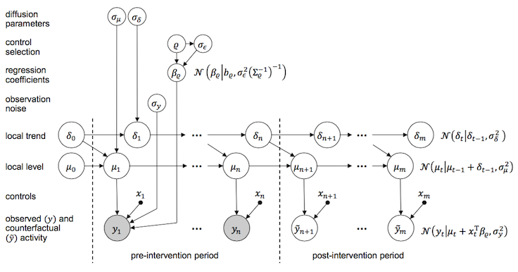

```{r,echo=F}
set.seed(12345)
library(ggplot2)
```


## Plan 

  1. What it is and why people use it
  
  2. Causal identification 
  
  3. Frequentist Approaches to Estimation 
  
  4. Sources of Bias and Over-Confidence 
  
  5. What would google do?
    - Bayesian Structural Time-Series 
    - An invitation to collaborate


# What it is and why people use it

## What it is

- A method for constructing counterfactuals

```{r,echo=FALSE,cache=T,warning=F,message=F}


dat <- data.frame(
  post = rep(1:10,each = 2),
  treatment = rep(c(0,1),10)
)

dat$Y1 <- NA
dat$Y0 <- NA
dat$Y0[dat$treatment == 0] <- 10:1 + runif(10)
dat$Y0[dat$treatment == 1] <- dat$Y0[dat$treatment == 0]+5

dat$Y1 <- dat$Y0 + 2
dat$Y <- NA
dat$Y[dat$treatment == 0] <- dat$Y0[dat$treatment == 0]
dat$Y[dat$treatment == 1&dat$post<6] <- dat$Y0[dat$treatment == 1&dat$post<6]
dat$Y[dat$treatment == 1&dat$post>5] <- dat$Y1[dat$treatment == 1&dat$post>5]
dat$Y_pred <- NA
dat$Y_pred[dat$treatment == 1&dat$post>5] <- dat$Y0[dat$treatment == 1&dat$post>5]
dat$treatment <- as.factor(dat$treatment)
```
```{r,echo=FALSE,cache=T,warning=F,message=F,fig.height=3}
plot_dat_1 <- subset(dat,treatment == 1)
Y_at_end <- with(plot_dat_1,Y[post==10])
Y_at_start <- with(plot_dat_1,Y[post==1])
ggplot(plot_dat_1) + geom_line(aes(x = post, y = Y,color = treatment)) +
  # geom_point(aes(x = post, y = Y_pred)) +
  theme_bw() +
  scale_color_discrete("",labels = c("Treated")) +
  scale_x_continuous("Time",
                     breaks = c(2.5,5.5,7.5), 
                     labels = c("Pre","Intervention","Post")) +
  geom_vline(xintercept = 5.5) +
  geom_hline(aes(yintercept = c(Y[post==1],
                            Y[post==10])),
             linetype = 2,size = .5) +
  scale_y_continuous("Y",breaks = round(c(0,15,10,5,Y_at_end,Y_at_start
                            ),1)) +
#   geom_segment(aes(x = 8, y = Y_pred[post==8], 
#                    xend = 8, yend = Y[post==8]),
#                linetype = 3) +
  coord_cartesian(ylim = c(0,17))

```

- $\tau = 2$
- $\hat{\tau} = -7.1$

## What it is

- A method for constructing counterfactuals

```{r,echo=FALSE,cache=T,warning=F,message=F,fig.height=3}
plot_dat_2 <- dat
# I did a weird thing here and inverted the treatment indicator to keep the 
# colors constant, sorry about that:
plot_dat_2$treatment <- as.factor(2-as.numeric(plot_dat_2$treatment))
Y_prediction <- with(plot_dat_2,Y_pred[post==7&treatment == 0])
Y_observed <- with(plot_dat_2,Y[post==7&treatment == 0])
ggplot(plot_dat_2) + geom_line(aes(x = post, y = Y,color = treatment)) +
  geom_point(aes(x = post, y = Y_pred)) +
  theme_bw() +
  scale_color_discrete("",labels = c("Treated","Untreated")) +
  scale_x_continuous("Time",
                     breaks = c(2.5,5.5,7.5), 
                     labels = c("Pre","Intervention","Post")) +
  geom_vline(xintercept = 5.5) +
  geom_hline(yintercept = c(Y_observed,
                            Y_prediction),
             linetype = 2,size = .5) +
  scale_y_continuous("Y",breaks = c(0,15,10,5,round(Y_observed,1),
                                       round(Y_prediction,1))) +
  geom_segment(x = 7, y = Y_prediction, 
                   xend = 7, yend = Y_observed,
               linetype = 3)+
  coord_cartesian(ylim = c(0,17))
```

- $\tau = 2$ 
- $\hat{\tau} = 2$

## What it is

- We estimate causal effects as the difference between what we observe and what we predict we would have observed in the absence of "treatment"

- Does not require that unobserved heterogeneity in baseline is equal cross-sectionally

- Does require that unobserved heterogeneity in "trends" is equal cross-sectionally

- Requires that you have more than two units at more than two times, with 

## Why people use it

- Often things we can't randomize, or that have already happened in a non-random way

- Often good reasons to believe that things will evolve similarly in time

- In such cases, can provide causal estimate that accounts for unobserved heterogeneity in general trends, cross-sectional differences and treatment assignment propensities

- Everything hinges on the validity of the counterfactual predictions

## Main disadvantages

- Easy to have over-confident estimates (serial correlation)

- Easy to have biased estimates (violation of identification assumptions)


# Identification assumptions

## Traditional concerns 

  - Exclusion restriction still applies 
    - Can't be anything about being assigned to the treatment that affects outcomes except for the treatment
  
  - SUTVA
    - includes both inter-temporal and cross-unit spillovers 
    - Damian Clarke (2015) has a paper on how to do DiD in presence of spillovers

## Parallel paths, parallel growths

  - Ideal situation = trends common across units 
    - but DiD actually viable even in presence of unit-specific trends

  - **if untreated**, those who **received treatment** would have an 
  outcome equivalent to their **outcome in the last pre-treatment period, plus whatever change took place** in the periods among those who did not receive treatment 
## Parallel paths, parallel growths
  
Requires ignorability in *trends* 

  - not ignorability in all unobserved heterogeneity
  - assumption that *changes* remain constant in the absence of treatment 

## Parallel paths, parallel growths

In the simplest case of common trends and two time periods

  - we don't assume $E[Y(0)|Z=1] = E[Y(0)|Z=0]$

but: 
  
  - $E[Y(0,1) - Y(0,0)|Z=1] = E[Y(0,1) - Y(0,0)|Z=0]$
  
Where $Y(z_i,t)$

## Parallel paths, parallel growths

  - It is possible to do DiD even when there are unit-specific trends
  
  - $L$ takes the difference between the current and some previous time period
  
  - $LX_t = X_{t-1}$ and $X_t = LX_{t+1}$
  
Then, we can use this operator to define changes in $Y$:
  
  - $\Delta Y_t = (1 - L)Y_t = Y_t - Y_{t-1}$
  
You can also get the second-difference operator (i.e. growth-in-growth, acceleration) by exponentializing the $L$ operator: 
  
  - $\Delta^2 X_t = (1-L)\Delta X_t = (1 - L)(1 - L)X_t = (1 - L)^2 X_t$
  
## Parallel paths, parallel growths

Mora and Reggio (2012) use $\Delta_s = (1-L^s)$ 

- They define a "parallel growth" or "parallel-$q$" estimand, assuming:

$$E[\Delta_s Y_{t^*+s}^0 | X, D = 1] = E[\Delta_s Y_{t^* + s}^0 | X, D = 0]$$

*and* 

$$E[Y_{t^*+s}^0 | X, D = 1] = 
E[Y_{t^*} | X, D = 1] + 
E[\Delta_s Y_{t^*+s}^0 | X, D = 0]$$

- Where $t^*$ denotes the last pre-treatment period

##

  
- this is a good argument for including lots of time-level covariates

- what do time-level FE do here? i.e. if we think that each period 
  has independent time effects? 
  
     - there definitely might be scope for writing this up as a Bayesian model
       with time-level effects 


*DiD* with parallel paths is a special case of the $s$-period operator, in 
which there is just 1 period: 

$$ \alpha(1|X) = E[\Delta Y_{t^* +1} | X, D = 1] - 
E[\Delta Y_{t^* +1} | X, D = 0]$$

  


## Frequentist Approaches to Estimation 

Math here 
- mention some of the estimators

## Sources of Bias and Over-Confidence

- serial correlation 

- violation of assumptions


## What would Google do?

- all we want to do with difference-in-differences is predict a counterfactual

- our tools for prediction have grown well beyond the time-series models that economists like

- we can use a machine-learning logic in the pre-treatment (training) data to predict the counterfactual in the post-treatment period (testing)

## What would Google do?

We've been testing and applying structural time-series models for some time at Google. For example, we've used them to better understand the effectiveness of advertising campaigns and work out their return on investment. We've also applied the models to settings where a randomised experiment was available, to check how similar our effect estimates would have been without an experimental control.

Our main motivation behind creating the `CausalImpact` package has been to find a better way of measuring the impact of ad campaigns on outcomes. However, the `CausalImpact` package could be used for many other applications involving causal inference. Examples include problems found in economics, epidemiology, or the political and social sciences.

## What would Google do?

- construct a synthetic control using the posterior predictive distribution

- ...of a very flexible 

## Bayesian State-Space Model



## An R package for causal inference using Bayesian structural time-series models

#### What does the package do?
This R package implements an approach to estimating the causal effect of a designed intervention on a time series. For example, how many additional daily clicks were generated by an advertising campaign? Answering a question like this can be difficult when a randomized experiment is not available.

#### How does it work?
Given a response time series (e.g., clicks) and a set of control time series (e.g., clicks in non-affected markets or clicks on other sites), the package constructs a Bayesian structural time-series model. This model is then used to try and predict the counterfactual, i.e., how the response metric would have evolved after the intervention if the intervention had never occurred. For details, see: [Brodersen et al., Annals of Applied Statistics (2015)](http://research.google.com/pubs/pub41854.html).

#### What assumptions does the model make?
As with all non-experimental approaches to causal inference, valid conclusions require strong assumptions. In the case of CausalImpact, we assume that there is a set control time series that were *themselves not affected by the intervention.* If they were, we might falsely under- or overestimate the true effect. Or we might falsely conclude that there was an effect even though in reality there wasn't. The model also assumes that the relationship between covariates and treated time series, as established during the pre-period, remains stable throughout the post-period (see `model.args$dynamic.regression` for a way of relaxing this assumption). Finally, it's important to be aware of the *priors* that are part of the model (see `model.args$prior.level.sd` in particular).

#### How is the package structured?
The package is designed to make counterfactual inference as easy as fitting a regression model, but much more powerful, provided the assumptions above are met. The package has a single entry point, the function `CausalImpact()`. Given a response time series and a set of control time series, the function constructs a time-series model, performs posterior inference on the counterfactual, and returns a `CausalImpact` object. The results can be summarized in terms of a table, a verbal description, or a plot.


## 1. Installing the package

To install `CausalImpact`, type the following commands into an R session:

```{r, eval=FALSE}
install.packages("devtools")
library(devtools)
devtools::install_github("google/CausalImpact")
```

Once installed, the package can be loaded in a given R session using:

```{r, message=FALSE, warning=FALSE, eval=FALSE}
library(CausalImpact)
```

## 2. Creating an example dataset

To illustrate how the package works, we create a simple toy dataset. It consists of a response variable `y` and a predictor `x1`. Note that in practice, we'd strive for including many more predictor variables and let the model choose an appropriate subset. The example data has 100 observations. We create an *intervention effect* by lifting the response variable by 10 units after timepoint 71.
```{r, eval=FALSE}
set.seed(1)
x1 <- 100 + arima.sim(model = list(ar = 0.999), n = 100)
y <- 1.2 * x1 + rnorm(100)
y[71:100] <- y[71:100] + 10
data <- cbind(y, x1)
```

We now have a simple matrix with 100 rows and two columns:
```{r, eval=FALSE}
dim(data)
head(data)
```

We can visualize the generated data using:
```{r, eval=FALSE, eval=FALSE}
matplot(data, type = "l")
```
```{r, echo=FALSE, fig.width=5, fig.height=2.8,eval=F}
par(cex = 0.85, oma = c(0, 0, 0, 0), mar = c(3, 2, 1, 1))
matplot(data, type = "l", lwd = 1.5)
```

## 3. Running an analysis

To estimate a causal effect, we begin by specifying which period in the data should be used for training the model (*pre-intervention period*) and which period for computing a counterfactual prediction (*post-intervention period*).
```{r, eval=FALSE}
pre.period <- c(1, 70)
post.period <- c(71, 100)
```

This says that time points 1 ... 70 will be used for training, and time points 71 ... 100 will be used for computing predictions. Alternatively, we could specify the periods in terms of dates or time points; see [Section 5](#working-with-dates-and-times) for an example.

To perform inference, we run the analysis using:
```{r, eval=FALSE}
impact <- CausalImpact(data, pre.period, post.period)
```

This instructs the package to assemble a structural time-series model, perform posterior inference, and compute estimates of the causal effect. The return value is a `CausalImpact` object.

## 4. Plotting the results

The easiest way of visualizing the results is to use the `plot()` function that is part of the package:
```{r, fig.width=8, fig.height=6, eval=FALSE}
plot(impact)
```
```{r, include=FALSE}
library(ggplot2)
```
```{r, echo=FALSE,eval=F}
plot(impact) + theme_bw(base_size = 11)
```

By default, the plot contains three panels. The first panel shows the data and a counterfactual prediction for the post-treatment period. The second panel shows the difference between observed data and counterfactual predictions. This is the *pointwise* causal effect, as estimated by the model. The third panel adds up the pointwise contributions from the second panel, resulting in a plot of the *cumulative* effect of the intervention.

Remember, once again, that all of the above inferences depend critically on the assumption that the covariates were not themselves affected by the intervention. The model also assumes that the relationship between covariates and treated time series, as established during the pre-period, remains stable throughout the post-period.

## 5. Working with dates and times

It is often more natural to feed a time-series object into `CausalImpact()` rather than a data frame. For example, we might create a `data` variable as follows:

```{r, eval=FALSE}
time.points <- seq.Date(as.Date("2014-01-01"), by = 1, length.out = 100)
data <- zoo(cbind(y, x1), time.points)
head(data)
```

We can now specify the pre-period and the post-period in terms of time points rather than indices:

```{r, eval=FALSE}
pre.period <- as.Date(c("2014-01-01", "2014-03-11"))
post.period <- as.Date(c("2014-03-12", "2014-04-10"))
```

As a result, the x-axis of the plot shows time points instead of indices:

```{r, fig.width=8, fig.height=6, eval=FALSE}
impact <- CausalImpact(data, pre.period, post.period)
plot(impact)
```
```{r, echo=FALSE, eval=FALSE}
impact <- CausalImpact(data, pre.period, post.period)
plot(impact) + theme_bw(base_size = 11)
```

## 6. Printing a summary table

To obtain a numerical summary of the analysis, we use:
```{r, eval=FALSE}
summary(impact)
```

The **Average** column talks about the average (across time) during the post-intervention period (in the example: time points 71 through 100). The **Cumulative** column sums up individual time points, which is a useful perspective if the response variable represents a flow quantity (such as queries, clicks, visits, installs, sales, or revenue) rather than a stock quantity (such as number of users or stock price).

In the example, the estimated average causal effect of treatment was 11 (rounded to a whole number; for full precision see `impact$summary`). This is because we observed an average value of 99 but would have expected an average value of only 89. The 95% posterior interval of the average effect is [9.8, 11]. Since this excludes 0, we (correctly) conclude that the intervention had a causal effect on the response variable. Since we generated the data ourselves, we know that we injected a true effect of 10, and so the model accurately recovered ground truth. One reason for this is that we ensured, by design, that the covariate `x1` was not itself affected by the intervention. In practice, we must always reason whether this assumption is justified.

For additional guidance about the correct interpretation of the summary table, the package provides a verbal interpretation, which we can print using:
```{r, eval=FALSE}
summary(impact, "report")
```

The individual numbers in the table, at full precision, can be accessed using:
```{r, eval=FALSE}
impact$summary
```

See below for tips on how to use these commands with *knitr* / *R Markdown*.

## 7. Adjusting the model

So far, we've simply let the package decide how to construct a time-series model for the available data. However, there are several options that allow us to gain a little more control over this process. These options are passed into `model.args` as individual list elements, for example:
```{r, eval=FALSE}
impact <- CausalImpact(..., model.args = list(niter = 5000, nseasons = 7))
```

### Available options

* `niter` Number of MCMC samples to draw. More samples lead to more accurate inferences. Defaults to __1000__.

* `standardize.data` Whether to standardize all columns of the data before fitting the model. This is equivalent to an empirical Bayes approach to setting the priors. It ensures that results are invariant to linear transformations of the data. Defaults to __TRUE__.

* `prior.level.sd` Prior standard deviation of the Gaussian random walk of the local level. Expressed in terms of data standard deviations. Defaults to __0.01__, a typical choice for  well-behaved and stable datasets with low residual volatility after regressing out known predictors (e.g., web searches or sales in high quantities). When in doubt, a safer option is to use __0.1__, as validated on synthetic data, although this may sometimes give rise to unrealistically wide prediction intervals.

* `nseasons` Period of the seasonal components. In order to include a seasonal component, set this to a whole number greater than 1. For example, if the data represent daily observations, use 7 for a day-of-week component. This interface currently only supports up to one seasonal component. To specify multiple seasonal components, use bsts to specify the model directly, then pass the fitted model in as bsts.model. Defaults to __1__, which means no seasonal component is used.

* `season.duration` Duration of each season, i.e., number of data points each season spans. Defaults to __1__. For example, to add a day-of-week component to data with daily granularity, use __model.args = list(nseasons = 7, season.duration = 1)__. To add a day-of-week component to data with hourly granularity, set __model.args = list(nseasons = 7, season.duration = 24)__.

* `dynamic.regression` Whether to include time-varying regression coefficients. In combination with a time-varying local trend or even a time-varying local level, this often leads to overspecification, in which case a static regression is safer. Defaults to __FALSE__.

## 8. Using a custom model

Instead of using the default model constructed by the CausalImpact package, we can use the bsts package to specify our own model. This provides the greatest degree of flexibility.

Before constructing a custom model, we set the observed data in the post-treatment period to NA, reflecting the fact that the counterfactual response is unobserved after the intervention. We keep a copy of the actual observed response in the variable `post.period.response`.
```{r, eval=FALSE}
post.period <- c(71, 100)
post.period.response <- y[post.period[1] : post.period[2]]
y[post.period[1] : post.period[2]] <- NA
```

We next set up and estimate a time-series model using the bsts package. Here is a simple example:
```{r, echo=FALSE, eval=FALSE}
ss <- AddLocalLevel(list(), y)
bsts.model <- bsts(y ~ x1, ss, niter = 1000, ping = 0)
```
```{r, eval=FALSE}
ss <- AddLocalLevel(list(), y)
bsts.model <- bsts(y ~ x1, ss, niter = 1000)
```

Finally, we call `CausalImpact()`. Instead of providing input data, we simply pass in the fitted model object (`bsts.model`). We also need to provide the actual observed response. This is needed so that the package can compute the difference between predicted response (stored in `bsts.model`) and actual observed response (stored in `post.period.response`).
```{r, eval=FALSE}
impact <- CausalImpact(bsts.model = bsts.model,
                       post.period.response = post.period.response)
```

The results can be inspected in the usual way:
```{r, eval=FALSE}
plot(impact)
summary(impact)
summary(impact, "report")
```


## An invitation to collaborate

  - new computational techniques enable much better prediction than current DiD uses

  - `CausalImpact` uses a Gibbs sampler, could Stan do better? 
    - Stan can't do "spike-and-slab" due to degenerative spike
    - but maybe this isn't necessary?
  
  - Agenda:
    - Build something good using BSTS + HMC or Gibbs
    - Benchmark synthetic control against real experimental controls and "traditional" DiD
    
  - 


